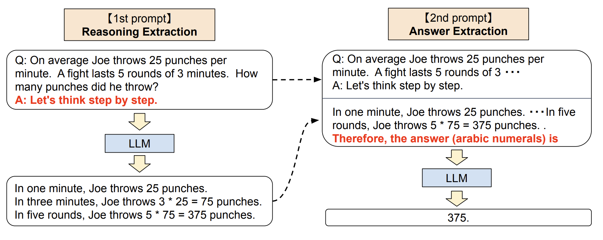

# Vector & Embeddings

### 向量和Embeddings的作用

想象一下，现在数据库中有一段文本，内容是“这只老鼠正在寻找食物”。

用户输入一个查询：奶酪

如果我们仅仅是使用文本搜索，将无法识别该段落，它不包含任何相同的文字。

但通过使用embeddings，这两段文字都将转化为向量，然后可以在这两段文字的向量上执行相似性搜索。

由于 “老鼠” 和 "奶酪" 在上下文中存在某种关系，尽管两段文字没有匹配的词语，用户还是能够通过向量间的相似性得出这段文字。

这正说明了向量嵌入的价值 - 它能够 捕捉到上下文之间的关系，而不是只依靠精确匹配。这样就可以超出文字本身，基于更广泛的意义找到相似的内容。

### 什么是向量

从数学角度来说，向量是一个具有大小和方向的数学构造。例如,我们可以把向量想象成空间中一个点,“方向”就是从(0,0,0)到该点的矢量空间中的一个箭头。

<figure><figcaption></figcaption></figure>

从开发人员来看，我们可以更容易地将向量看作包含数值的数组。例如:

_**vector = \[0,-2,...4]**_

当我们查看同一空间中的许多向量时，我们可以说某些向量彼此近在咫尺，而其他向量相距甚远。 一些向量似乎会聚集在一起,而另一些向量可能在空间中分布稀疏。

<figure><figcaption></figcaption></figure>

通过一个可视化的三维的Embeddings，来理解嵌入模型的工作原理。这里中标出了多个数据点，每个点代表一个单词的向量embedding。距离近的单词在语义上相似，而距离远的单词语义不同。

<figure><figcaption></figcaption></figure>

一旦训练完成，嵌入模型可以将我们的原始数据转换为向量embedding。这意味着它知道如何将新的数据点放置在向量空间中。

<figure><figcaption></figcaption></figure>

这种embedding使得可以比较单词之间的相似性，且具有逻辑意义 - 如同义词出现在一起，不同义词分开。通过这种方法，嵌入模型学习了数据之间的隐含关系，并将其反映在向量空间之中。这正是保留原始数据含义的关键。

正如我们在图中看到的，在模型层面上，距离较近的向量在上下文中具有相似性，而相距较远的向量则相互不同。这正是向量具有真正含义的地方 - 它与向量空间中的其他向量的关系取决于嵌入模型是如何"理解"它所被训练的数据集的。嵌入模型根据上下文将近似的向量嵌入在一起。

向量embedding的目的是传达数据之间的关系，而不仅仅是将数据转换为向量。嵌入模型利用它从数据中学习到的模式，将具有上下文相似性的数据点嵌入在一起。

### 向量的相似性

### 为什么更推荐使用 embeddings而不是 fine-tuning

Openai CookBook中提到，更推荐使用使用 embeddings。这是因为embeddings具有zero-short的优势。

那么什么是zero-short？


Reference

[Vector Embeddings for Developers](https://www.pinecone.io/learn/vector-embeddings-for-developers/)

[What is a Vector Database?](http://localhost:5000/s/aC0LjN8LnoW1EQtmZMbv/about-us/vision-mission-and-focus/vision)


